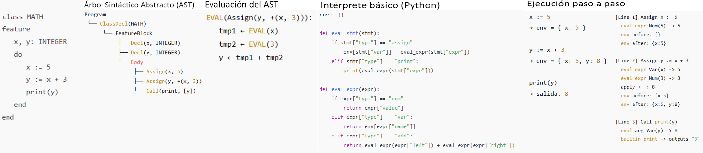

# Interpretes

## Intérpretes (store passing y evaluación)



## Interprete Directo

$$
\mathcal{L}_{\text{fuente}}(P, X)
=
\mathcal{L}_{\text{impl}}(I,\; [P] \mathbin{++} X)
$$

𝐿<sub>fuente</sub>: Función semántica del lenguaje fuente.  
𝐿<sub>impl</sub>: Función semántica de la máquina/entorno donde corre el intérprete.  
𝑃: programa fuente.  
𝑋: entrada del programa.  
[𝑃]: representación codificada del programa (AST, bytecode, texto), que el intérprete puede consumir.  
𝐼: intérprete.  
[𝑃]++𝑋: la entrada de la máquina de implementación es el intérprete seguido por la codificación del programa y su entrada.

Ejemplo de interprete
```haskell
data Expr = ExprConstNum Int     -- n
          | ExprAdd Expr Expr    -- e1 + e2
eval01A :: Expr -> Int

eval :: Expr -> Int
eval (ExprConstNum n) = n
eval (EvalAdd e1 e2)  = eval e1 + eval e2

eval (ExprAdd (ExprConstNum 2) (ExprConstNum 5))
```

Definicion de Entorno
```haskell
emptyEnv :: Env a
lookupEnv :: Env a -> Id -> a
extendEnv :: Env a -> Id -> Env a
```

Extender el interprete
```haskell
data Expr = ExprConstNum Int     -- n
          | ExprConstBool Bool   -- b
          | ExprAdd Expr Expr    -- e1 + e2
          | ExprVar Id           -- x
          | ExprLet Id Expr Expr -- let x = e1 in e2 -- evaluo e2 con el parametro x que va a ser el resultado de evaluar e1
eval02Env :: Expr -> Env Val -> Val

data Val = VN Int
         | VB Bool

eval :: Expr -> Env Val -> Val
eval (ExprConstNum n)  env = VN n
eval (ExprConstBool b) env = VB b
eval (EvalAdd e1 e2)   env = addVal (eval e1 env) (eval e2 env)
eval (ExprVar x)       env = lookupEnv env x
eval (ExprLet x e1 e2) env = eval e2 (extend env x (eval e1 env))

addVal :: Val -> Val -> Val
addVal (VN a) (VN b) = VN (a + b)
addVal _      _      = error "Solo se pueden sumar numeros"
```

Ejemplo de uso
```haskell
ejemplo :: Expr
ejeplo =
  ExprLet "x"
    (ExprConstNum 5)
    (ExprLet "y" (ExprAdd (ExprVar "x") (ExprVar "x"))
      (ExprLet "y" (ExprAdd (ExprVar "x") (ExprVar "y"))
        (ExprVar "y")))

eval ejemplo emptyEnv     -- VN 15
```

---
Ejemplo de algo, Reyna

```python
env = {}

def eval_stmt(stmt):
	if stmt["type"] == "assign":
		env[stmt["var"]] = eval_expr(stmt["expr"])
	elif stmt["type"] == "print":
		print(eval_expr(stmt["expr"]))

def eval_expr(expr):
	if expr["type"] == "num":
		return expr["value"]
	elif expr["type"] == "var":
		return env[expr["name"]]
	elif expr["type"] == "add":
		return eval_expr(expr["left"]) + eval_expr(expr["right"])
```

---
## Store-Passing (para lenguaje imperativo)

Extendemos el lenguaje con
```haskell
x := e  --Asignacion
e1; e2  --Componer 2 programas en secuencia (descarta resultado de e1 pero modifica la memoria)
```
```haskell
data Expr = ExprConstNum Int     -- n
          | ExprConstBool Bool   -- b
          | ExprAdd Expr Expr    -- e1 + e2
          | ExprVar Id           -- x
          | ExprLet Id Expr Expr -- let x = e1 in e2
          | ExprSeq Expr Expr    -- e1; e2
          | ExprAssign Id Expr   -- x := e
```
Las variables del entorno estan ligadas a direcciones de memoria, y en la memoria estan almacenados los valores concretos

Extiendo definicion de Entorno
```haskell
emptyMemory :: Memory a   --devuelve una memoria vacia
allocate    :: Memory a -> Addr  --Devuelve una direccion de memoria sin usar
store       :: Memory a -> Addr -> a -> Memory a --Almacena el valor dado en la posicion indicada
dereference   :: Memory a -> Addr -> a --Devuelve el valor almacenado en la posicion indicada
```

Definiciones
```haskell
eval03Mem :: Expr -> Env Addr -> Memory Val -> (Val, Memory Val)

eval :: Expr -> Env Addr -> Memory Val -> (Val, Memory Val)
eval (ExprConstNum n)  env mem0 = (VN n, mem0)
eval (ExprConstBool b) env mem0 = (VB b, mem0)
eval (EvalAdd e1 e2)   env mem0 = 
    let (v1, mem1) = eval e1 env mem0 in 
    let (v2, mem2) = eval e2 env mem1 in
        (addVal V1 V2, mem2)
eval (ExprVar x)       env mem0 = 
    (dereference mem0 (lookupEnv env x), mem0)
eval (ExprLet x e1 e2) env mem0 = 
    let (v1, mem1) = eval e1 env mem0 in
    let a = allocate mem1 in
        eval e2 (extendEnv env x a) (store mem1 a v1)
eval (ExprSeq e1 e2)   env mem0 = 
    let (_, mem1) = eval e1 env mem0 in
        eval e2 env mem1
eval (ExprAssign x e)  env mem0 = 
    let (v, mem1) = eval e env mem0 in
        (VN 0, store mem1 (lookup env x) v)
```

Ejemplo de uso
```haskell
ejemplo :: Expr
ejeplo =
  ExprLet "x"
    (ExprConstNum 5)
    (ExprLet "y" (ExprConstNum 1)
      (ExprSeq
        (ExprAssign "x" (ExprAdd (ExprVar "x") (ExprVar "y")))
        (ExprSeq
          (ExprAssign "x" (ExprAdd (ExprVar "x") (ExprVar "x")))
          (ExprSeq
            (ExprAssign "x" (ExprAdd (ExprVar "x") (ExprVar "x")))
              (ExprVar "x")))))

eval ejemplo emptyEnv emptyMemory     -- (VN 8, <memoria>)
```

Ej: Extender interprete a una funcion `eval04MemControl` que incorpore las estructuras de control `if` y `while`.
```haskell
data Expr = ...
          | ExprLtNum Expr Expr    -- e1 < e2
          | ExprIf Expr Expr Expr  -- if e1 then e2 else e3
          | ExprWhile Expr Expr    -- while e1 do e2
```
```haskell
eval :: Expr -> Env Addr -> Memory Val -> (Val, Memory Val)
...
eval (ExprLtNum e1 e2)  env mem0 = 
    let (v1, mem1) = eval e1 env mem0 in 
    let (v2, mem2) = eval e2 env mem1 in
        ltNumVal v1 v2
eval (ExprIf e1 e2 e3)  env mem0 = 
    let (v1, mem1) = eval e1 env mem0 in
        if isTrueVal v1
            then eval e2 env mem1
            else eval e3 env mem1
eval (ExprWhile e1 e2)  env mem0 = 
    let (v1, mem1) = eval e1 env mem0 in
        if isTrueVal v1
            then let (_, mem2) = eval e2 env mem1 in
                eval (ExprWhile e1 e2) env mem2
            else (VN 0, mem1)

ltNumVal :: Val -> Val -> Val
ltNumVal (VN a) (VN b) = VB (a < b)
ltNumVal _      _      = error "Valores no numericos."

isTrueVal :: Val -> Bool
isTrueVal (VB True) = True
isTrueVal _         = False
```

---
Ejemplo de algo, Reyna
<table>
<tr><td style="vertical-align: top;">

```python
def eval_expr(expr, env, store):
    if expr["type"] == "num":
        return expr["value"], store
    elif expr["type"] == "var":
			addr = env.lookup(expr["name"])
			val = store.read(addr)
			return val, store
    elif expr["type"] == "add":
			v1, s1 = eval_expr(expr["left"], env, store)
			v2, s2 = eval_expr(expr["right"], env, s1)
			return v1 + v2, s2

def eval_stmt(stmt, env, store):
    if stmt["type"] == "assign":
			val, s1 = eval_expr(stmt["expr"], env, store)
			addr = env.lookup(stmt["target"])
			s1.update(addr, val)
			return s1
```

</td><td style="vertical-align: top;">

```python
class Environment:
	def __init__(self, parent=None):
		self.parent = parent
		self.map = {}

	def lookup(self, name):
		if name in self.map:
			return self.map[name]
		elif self.parent:
			return self.parent.lookup(name)
		else:
			raise RuntimeError(f"Variable '{name}' not defined")

class Store:
	def __init__(self):
		self.memory = {}
		self.next_addr = 0

	def alloc(self, value):
		addr = self.next_addr
		self.memory[addr] = value
		self.next_addr += 1
		return addr

	def update(self, addr, value):
		self.memory[addr] = value

	def read(self, addr):
		return self.memory[addr]
```

</td></tr>
</table>

---
## Continuation-Passing Style (CPS)

En lugar de devolver los resultados recursivamene, se puede trabajar con interpretes que pasen los resultados a una **continuacion**. Ena continuacion es una funcion que recibe un valor y un estado de la menoria y hace algo con ellos, devolviendo un resultado final.

```haskell
type Cont = (Val, Memory Val) -> Resultado -- tipo de la continuacion

eval05Cont :: Expr -> Env Addr -> Memory Val -> Cont -> Result
```

Definir el interprete CPS
```haskell
eval05Cont :: Expr -> Env Addr -> Memory Val -> Cont -> Result

eval05Cont = 

data Expr = ExprConstNum Int       -- n
          | ExprConstBool Bool     -- b
          | ExprAdd Expr Expr      -- e1 + e2
          | ExprVar Id             -- x
          | ExprLet Id Expr Expr   -- let x = e1 in e2
          | ExprSeq Expr Expr      -- e1; e2
          | ExprAssign Id Expr     -- x := e
          | ExprLtNum Expr Expr    -- e1 < e2
          | ExprIf Expr Expr Expr  -- if e1 then e2 else e3
          | ExprWhile Expr Expr    -- while e1 do e2

type Cont = (Val, Memory Val) -> Result -- tipo de la continuacion
```
```haskell
type Result --asd

eval :: Expr -> Env Addr -> Memory Val -> Cont -> Result
eval (ExprConstNum n)   env mem0 k = k (VN n, mem0)
eval (ExprConstBool b)  env mem0 k = k (VB b, mem0)
eval (EvalAdd e1 e2)    env mem0 k = 
    eval e1 env mem0 (\ (v1, mem1) -> 
        eval e2 env mem1 (\ (v2, mem2) ->
            k (addVal V1 V2, mem2) ) )
eval (ExprVar x)        env mem0 k = 
    k (dereference mem0 (lookupEnv env x), mem0)
eval (ExprLet x e1 e2)  env mem0 k = 
    eval e1 env mem0 (\ (v1, mem1) -> 
        let a = allocate mem1 in
            eval e2 (extendEnv env x a) (store mem1 a v1) k )   
eval (ExprSeq e1 e2)    env mem0 k = 
    eval e1 env mem0 (\ (_, mem1) ->
        eval e2 env mem1 k
    )
eval (ExprAssign x e)   env mem0 k = 
    eval e env mem0 (\ (v, mem1) -> 
        k (VN 0, store mem1 (lookup env x) v) )
eval (ExprLtNum e1 e2)  env mem0 k = 
    eval e1 env mem0 (\ (v1, mem1) ->
        eval e2 env mem1 (\ (v2, mem2) ->
            k (ltNumVal v1 v2, mem2) ) )
eval (ExprIf e1 e2 e3)  env mem0 k = 
    eval e1 env mem0 (\ (v1, mem1) ->
        if isTrueVal v1
            then eval e2 env mem1 k
            else eval e3 env mem1 k )
eval (ExprWhile e1 e2)  env mem0 k = 
    eval e1 env mem0 (\ (v1, mem1) -> 
        if isTrueVal v1
            then eval e2 env mem1 (\ (_, mem2) ->
                eval (ExprWhile e1 e2) env mem2 k )
            else k (VN 0, mem1)
    )
```

Se puede utilizar para implementar muchas estructuras de control:
- Excepciones
- ...

Sirve para forzar un orden de evaluacion (ej: para evaluar un lenguaje call-by-value cuendo el lenguaje de implementacion es call-by-name).

Se usa como lenguaje intermedio para compilar lenguajes funcionales.


---
Ejemplo de algo, Reyna


<table>
<tr><td style="vertical-align: top;">

```python
def eval_expr(expr, env, k):
    if expr["type"] == "num":
        return k(expr["value"])
    elif expr["type"] == "add":
			return eval_expr(expr["left"], env, 
				lambda v1: eval_expr(expr["right"], env,
					lambda v2: k(v1 + v2)))

def eval_stmt(stmt, env, k):
    if stmt["type"] == "assign":
			return eval_expr(stmt["expr"], env,
				lambda val: k(env.update({stmt["var"]: val})))
    elif stmt["type"] == "print":
			return eval_expr(stmt["expr"], env,
				lambda val: (print(val), k(env))[1])
```

</td><td style="vertical-align: top;">

```python
```

</td></tr>
</table>

Ejemplo

```go
x := 5
y := x + 1
print(y)
```
```ini
k0 = λ_. print(y)
k1 = λ_. y := x + 1; k0()
k2 = λ_. x := 5; k1()
```
