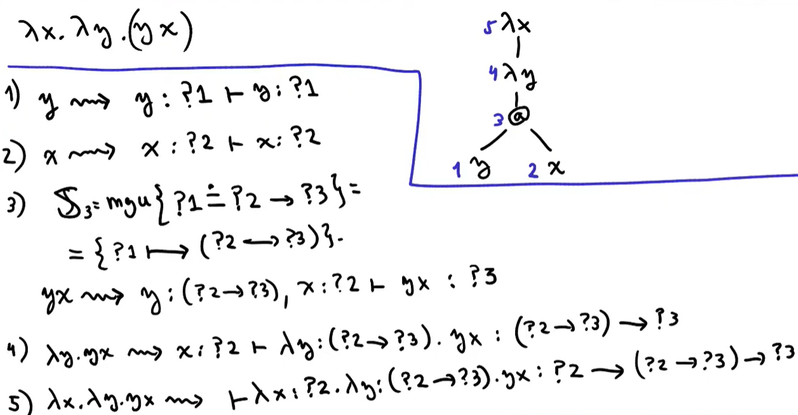
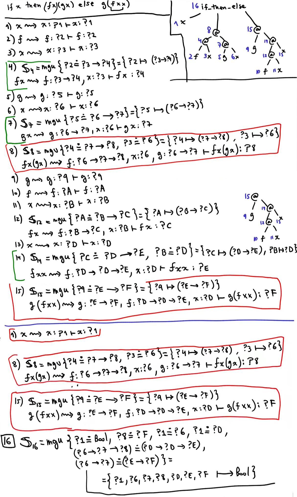

# Inferencia de Tipos

## Sistemas de Tipos

<table>
<tr><td style="vertical-align: top;">

$${ \over Γ ⊢ True : Bool} \hspace{2mm}  tTrue$$

 

$${ \over Γ ⊢ False : Bool} \hspace{2mm}  tFalse$$

 

$${ 
	Γ ⊢ M : Bool \hspace{8mm} Γ ⊢ N : τ \hspace{8mm} Γ ⊢ P : τ 
	\over 
	Γ ⊢ if \hspace{1mm} M \hspace{1mm} then \hspace{1mm} N \hspace{1mm} else \hspace{1mm} P : τ
} \hspace{2mm} tIf$$

</td><td style="vertical-align: top;">
&emsp;
</td><td style="vertical-align: top;">

$${ 
	Γ(x) = τ
	\over 
	Γ ⊢ x : τ
} \hspace{2mm} tVar$$

 

$${ 
	Γ ⊢ M : τ → σ \hspace{8mm} Γ ⊢ N : τ
	\over 
	Γ ⊢ MN : σ
} \hspace{2mm} tApp$$

 

$${ 
	Γ, x:τ ⊢ M : σ
	\over 
	Γ ⊢ λx:τ. M:τ → σ
} \hspace{2mm} tLam$$

</td></tr>
</table>

Reglas de Inferencia

<table>
<tr><td style="vertical-align: top;">

- (Const)

$${ \over Γ ⊢ 5 : INTEGER}$$

</td><td style="vertical-align: top;">
&emsp;
</td><td style="vertical-align: top;">

- (BinOp)
$${ 
	Γ ⊢ e1 : INTEGER \hspace{8mm} Γ ⊢ e2 : REAL 
	\over 
	Γ ⊢ e1 + e2 : REAL
}$$

</td></tr>
</table>

## Algoritmo de Unificacion

## Inferencia de tipos

## Ejemplos MGU

