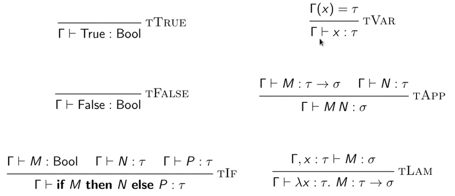
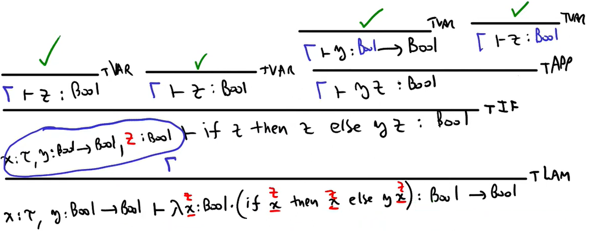
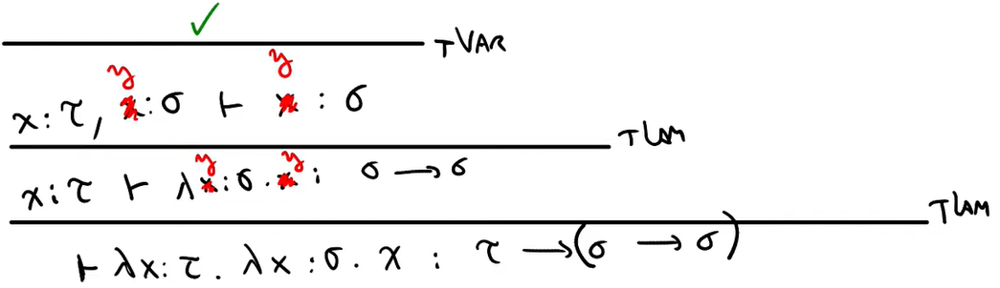
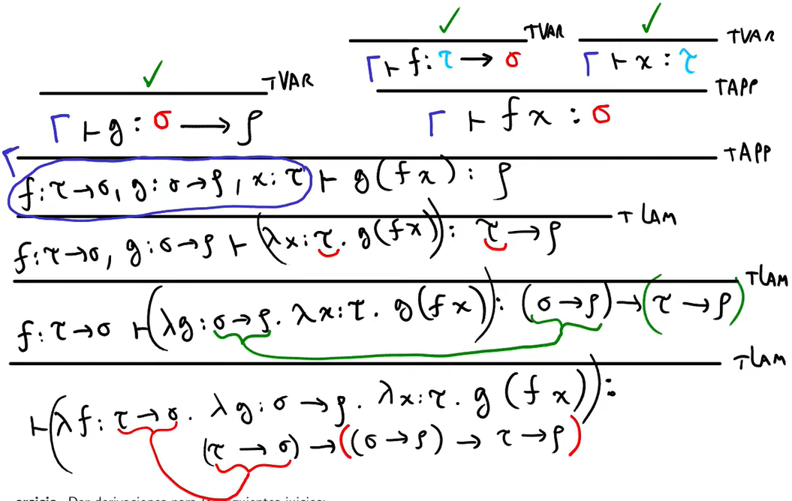
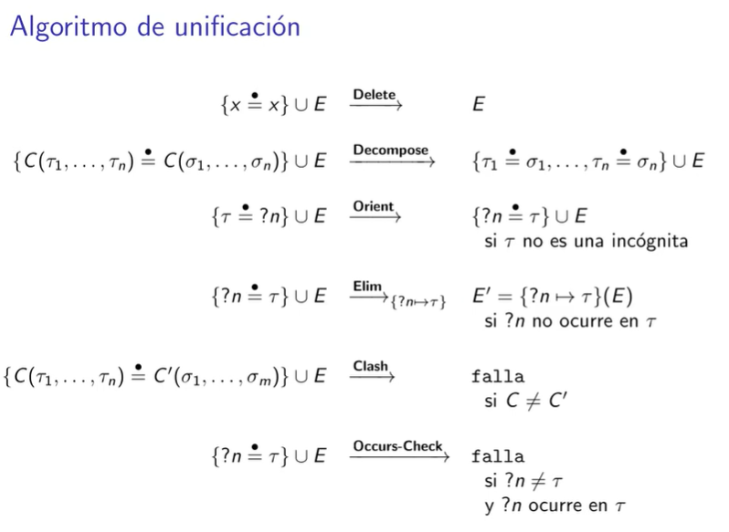
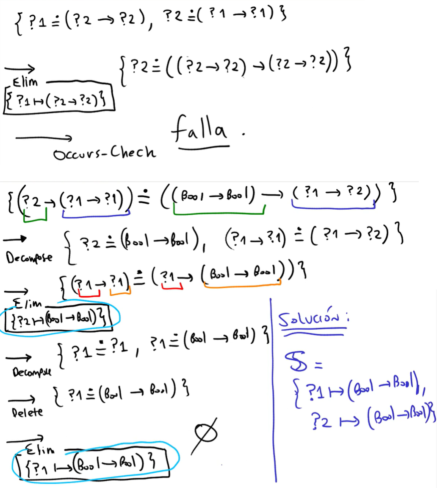
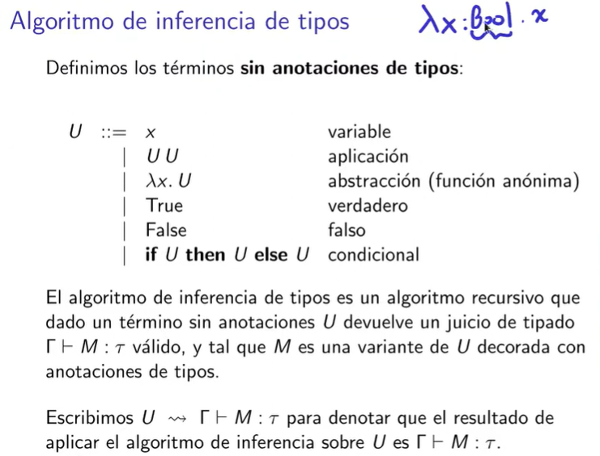
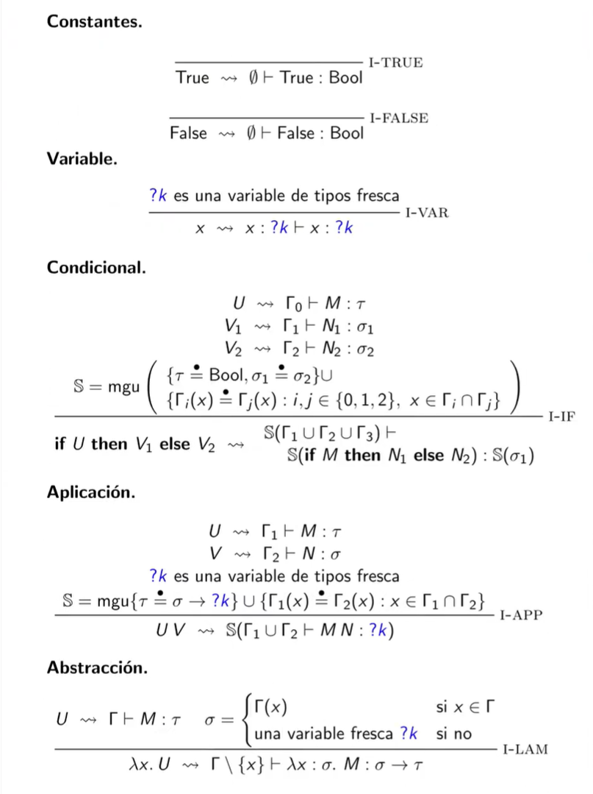

# Resumen


## Gramatica ambigüa
	2.2.4 Ambigu¨edad............................................. 47
	Para mostrar que una gramática es ambigua, todo lo que debemos hacer es buscar una cadena de terminales que sea la derivación de más de un árbol de análisis sintáctico.
	Ejemplo 2.5:
		cadena → cadena + cadena | cadena − cadena | 0 | 1 | 2 | 3 | 4 | 5 | 6 | 7 | 8 | 9

							cadena
						/			|  \
			  cadena 		+ cadena
				/  |  \				 |
		cadena - cadena    2
		   |        |
			 9        5

							cadena
						 /   |  \
					cadena -	cadena
						 |			/  |  \
						 9	cadena + cadena
									|        |
									5        2

	4.2.5 Ambigüedad.............................................. 203
	Una gramática ambigua es aquella que produce más de una derivación por la izquierda, o más de una derivación por la derecha para el mismo enunciado.
	4.3.2 Eliminación de la ambigüedad............................ 210
	G(V,L,T,S) si existe algun w(arbol de derivacion) ∊ L(G) con al menos una de los siguientes escenarios:
		2 derivaciones mas a la izquierda distintas
		2 derivaciones mas a la derecha distintas
		2 arboles de derivacion distintos


## Definiciones

**Variables Positiva**
>A \*⇒ w &emsp; A ∊ V &emsp; w ∊ T\*

**Variables Alcanzable**
>S \*⇒ 𝛂A𝛃 &emsp; A ∊ V &emsp; 𝛂,𝛃 ∊ (V ∪ T)\*

**Variables Util**
>S \*⇒ 𝛂A𝛃 \*⇒ w &emsp; A ∊ V &emsp; w ∊ T\* &emsp; 𝛂,𝛃 ∊ (V ∪ T)\*

Notas:
- Util ⟾ Positiva y Alcanzable &emsp; (Pero no al revez)

**Producciones Unitarias**
>A → B &emsp; A, B ∊ V 

**Producciones Epsilon**
>A → ɛ &emsp; A ∊ V 

**Variables Nullables**
>A \*⇒ ɛ &emsp; A ∊ V

## Gramatica Simplificada
	es una gramatica G=(V,T,P,S) donde:
		- todas sus variables son Utiles
			S *=> αAβ *=> w    A ∊ V    w ∊ T*    α,β ∊ (V ∪ T*)
		- no tiene producciones Unitarias
			A -> B
		- no tiene producciones epsilon
			A -> ε
	Para simplificar
		(1) Eliminacion de producciones epsilon
		(2) eliminacion de producciones Unitarias
		(3) Obtencion de valiables Positivas
			A *=> w    A ∊ V    w ∊ T*
		(4) Obtencion de valiables Alcanzables
			S *=> αAβ    A ∊ V    α,β ∊ (V ∪ T*)

## Teorema General de Simplificacion


## Forma Normal de Chomsky (FNC)
	Se dice que una gramática está en Forma Normal de Chomsky (FNC) si toda producción es de la forma A → BC o de la forma A → a, en donde A, B y C son no terminales, y a es un terminal.
		A → BC
		A → a
	Ejemplo:
		S → AB
		A → 0
		B → 1 | SC
		C → 1

## Forma Normal de Greibach (FNG)
		A → α
	Ejemplo:
		S → 0SB
		S → 0B
		B → 1
		

## FIRST FOLLOW
	4.4.2 PRIMERO y SIGUIENTE [pagina 220]
	FIRST
	FOLLOW
		1. Si S es estado inicial agrego $ a FOLLOW(S)
		2. B -> αAβ
			FOLLOW(A) = FIRST(β)
		3. B -> αA  o  B -> αAβ y β *=> ε
			FOLLOW(A) = FOLLOW(B)
			

## Armar tabla LL(1)
	Sea una producción A → α
		Si FIRST(α) = {a}:
			M[A, a] = A → α
		Si ε ∊ FIRST(α), busco FOLLOW(A) = {b}:
			M[A, b] = A → α
		Si en algún momento intentas poner dos producciones distintas en la misma celda M[A, t], tienes conflicto → la gramática no es LL(1).


## Bottom-Up

	Shift
		Cuando leo un caracter de la entrada
	Reduce
		Cuando transformo la cadena procesada aplicando una produccion que la defina

Ej: Usar el algoritmo para el analisis sintactico ascendente con la gramatica G=({E,T,F},{+,*,n,(,)},P,E):
```
	E → T | E + T
	T → F | T * F
	F → n | (E) 
```
para la entrada `n*n+n`

| Pila | Entrada |  |
| :-------- | ------------: | :---- |
|  | `n*n+n` | Shift |
| `n` | `*n+n` | Reduce |
| `F` | `*n+n` | Reduce |
| `T` | `*n+n` | Shift |
| `T*` | `n+n` | Shift |
| `T*n` | `+n` | Reduce |
| `T*F` | `+n` | Reduce |
| `T` | `+n` | Reduce |
| `E` | `+n` | Shift |
| `E+` | `n` | Shift |
| `E+n` | `$` | Reduce |
| `E+F` | `$` | Reduce |
| `E+T` | `$` | Reduce |
| `E` | `$` | Accept |

## LR(0)

### Closure

Ej: 
```
	E' → E$
	E → T | E + T
	T → n | (E) 
```


```
	I 		= { E' → •E$ }
	I' 		= { E' → •E$ , E → •T , E → •E + T}
	I'' 	= { E' → •E$ , E → •T , E → •E + T , T → •n , T → •(E)}
	I''' 	= I''
```

`Clausura (I) = I''`

### AFD para LR(0)

-AFD.drawio.svg)

### tabla ACTION/GOTO

|   | GOTO       ||| ACTION             |||||
|:--|:--:|:--:|:--:|:--:|:--:|:--:|:--:|:--:|
|   | E' | E | T | n         | +  | (  | )  | $  |
| 1 |    | 2 | 9 | S6        | | S5 |  |  |
| 2 |    |   |   |           | S3 |  |  | ACCEPT |
| 3 |    |   | 4 | S6        |  | S5 |  |  |
| 4 |    |   |   | E → E + T | E → E + T | E → E + T | E → E + T | E → E + T |
| 5 |    | 7 |   | S6        | S9 | S5 |  |  |
| 6 |    |   |   | T → n     | T → n | T → n | T → n | T → n |
| 7 |    |   |   |           |  |  | S8 |  |
| 8 |    |   |   | T → (E)   | T → (E) | T → (E) | T → (E) | T → (E) |
| 9 |    |   |   | E → T     | E → T | E → T | E → T | E → T |

Es LR(0) porque no hay conflictos (mas de una produccion por celda)

Conflicto Reduce/Reduce

-conflicto-reduce-reduce.png)

Conflicto Shift/Reduce

-conflicto-shift-reduce.png)

Uso de la tabla para armar la pila

-uso-tabla.png)

## Intérpretes (store passing y evaluación)


### Forma Directa

```python
env = {}

def eval_stmt(stmt):
	if stmt["type"] == "assign":
		env[stmt["var"]] = eval_expr(stmt["expr"])
	elif stmt["type"] == "print":
		print(eval_expr(stmt["expr"]))

def eval_expr(expr):
	if expr["type"] == "num":
		return expr["value"]
	elif expr["type"] == "var":
		return env[expr["name"]]
	elif expr["type"] == "add":
		return eval_expr(expr["left"]) + eval_expr(expr["right"])
```

### Store Passing

```python
class Environment:
	def __init__(self, parent=None):
		self.parent = parent
		self.map = {}

	def lookup(self, name):
		if name in self.map:
			return self.map[name]
		elif self.parent:
			return self.parent.lookup(name)
		else:
			raise RuntimeError(f"Variable '{name}' not defined")

class Store:
	def __init__(self):
		self.memory = {}
		self.next_addr = 0

	def alloc(self, value):
		addr = self.next_addr
		self.memory[addr] = value
		self.next_addr += 1
		return addr

	def update(self, addr, value):
		self.memory[addr] = value

	def read(self, addr):
		return self.memory[addr]
```
```python
def eval_expr(expr, env, store):
    if expr["type"] == "num":
        return expr["value"], store
    elif expr["type"] == "var":
			addr = env.lookup(expr["name"])
			val = store.read(addr)
			return val, store
    elif expr["type"] == "add":
			v1, s1 = eval_expr(expr["left"], env, store)
			v2, s2 = eval_expr(expr["right"], env, s1)
			return v1 + v2, s2

def eval_stmt(stmt, env, store):
    if stmt["type"] == "assign":
			val, s1 = eval_expr(stmt["expr"], env, store)
			addr = env.lookup(stmt["target"])
			s1.update(addr, val)
			return s1
```

### Continuation-Passing Style - CPS

```python
def eval_expr(expr, env, k):
    if expr["type"] == "num":
        return k(expr["value"])
    elif expr["type"] == "add":
			return eval_expr(expr["left"], env, 
				lambda v1: eval_expr(expr["right"], env,
					lambda v2: k(v1 + v2)))

def eval_stmt(stmt, env, k):
    if stmt["type"] == "assign":
			return eval_expr(stmt["expr"], env,
				lambda val: k(env.update({stmt["var"]: val})))
    elif stmt["type"] == "print":
			return eval_expr(stmt["expr"], env,
				lambda val: (print(val), k(env))[1])
```

Ejemplo

```go
x := 5
y := x + 1
print(y)
```
```ini
k0 = λ_. print(y)
k1 = λ_. y := x + 1; k0()
k2 = λ_. x := 5; k1()
```

## Generación de Código Intermedio

Ejemplo de codigo fuente

```
c := a + b * 2
```

**Tres Direcciones** (Three Address Code – TAC) [Libro '6.2 Código de tres direcciones' pagina 389]

Características:

- Cada instrucción usa máximo 3 direcciones:
>`x = y op z`
- Introduce temporales.

Ejemplo:


```
t1 := b
t2 := 2
t2 := t1 * t2
t1 := a
t1 := t1 + t2
c  := t1
```

**Cuádruplas**

```
(op, arg1, arg2, result)

(*,  b, 2,  t1)
(+,  a, t1, t2)
(:=, t2, -,  c)
```


- código intermedio
- código intermedio con etiquetas y saltos
- optimización de temporales
- gramática de atributos
- notación posfija (postfijo)
- mini–máquina de tres direcciones

## Tipos e Inferencia (Algoritmo , unificación)

Reglas de Inferencia

- (Const)
	> Γ ⊢ 5 : INTEGER

- (BinOp)
	```
	Γ ⊢ e1 : INTEGER    Γ ⊢ e2 : REAL
	----------------------------------
	Γ ⊢ e1 + e2 : REAL
	```









inf-tipos unificacion





Inferencia de tipos





- Algoritmo de inferencia
- unificaciones
- Inferir tipo

## Análisis de Flujo de Datos (CFG(Control Flow Graph) y Reaching Definitions)

- código de tres direcciones
- bloques básicos
- grafo de flujo
- definiciones alcanzables (Reaching Definitions RD)
- variables vivas  (Live Variables)
- propagación de constantes
- formato de conjunto IN/OUT
- convergencia
- análisis inverso (hacia atrás) para detectar variables muertas
- eliminar instrucciones muertas